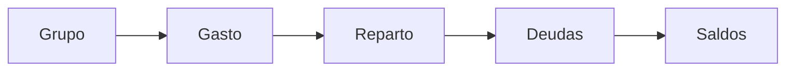

<div align="center">

# SplitFlow

**Dividí los gastos de tu grupo sin hacer cuentas a mano.**

Flutter · Android & iOS · API en FastAPI

[](https://flutter.dev)
[](https://dart.dev)
[](https://m3.material.io)
[](https://docs.flutter.dev/testing)

</div>

---

## Qué es

Un grupo de personas comparte gastos: un viaje, un depto, una salida. Cada uno paga
con su propia plata, cada compra se reparte entre los que participaron, y al final
hay que saldar. **SplitFlow calcula quién le debe qué a quién y propone el set
mínimo de pagos para dejar el grupo en cero.**

Sin planillas ni cuentas mentalas a mano. Registrás el gasto, quién lo pagó y
entre quiénes se reparte; el resto lo hace la app.

## Cómo funciona

El modelo mental de la app son cinco pasos. Todo lo demás es detalle de cada uno:



1. **Grupo** — armás un grupo e invitás a los demás por email o user ID.
2. **Gasto** — cargás un gasto: qué fue, quién lo pagó, en qué categoría.
3. **Reparto** — definís cómo se divide: en partes iguales o con un monto exacto
   por persona. La app calcula las partes al centavo.
4. **Deudas** — el backend calcula el balance de cada miembro y quién le debe a
   quién. Si pagaste la cena de cuatro, le debés tu parte a cada uno.
5. **Saldos** — la app propone el **camino más corto a cero**. Si hay cinco deudas
   cruzadas, con frecuencia se resuelven en dos o tres transferencias. Registrás el
   pago y la otra persona lo confirma.

Ese último punto es la diferencia: no se trata sólo de mostrar quién debe qué,
sino de mostrar **la forma más corta de saldar**.

## Qué se puede hacer

| | |
|---|---|
| 👤 **Cuentas** | Registro, login, perfil, cambio de contraseña, borrar cuenta. La sesión persiste cifrada en el dispositivo. |
| 👥 **Grupos** | Crear, renombrar, marcar como saldado, borrar, ver detalle. |
| ➕ **Miembros** | Sumar y quitar personas del grupo por email o user ID. |
| 🧾 **Gastos** | Crear, editar y borrar. Reparto igual o con montos exactos. |
| ⚖️ **Saldos** | Balance por miembro, quién le debe a quién y transferencias simplificadas. |
| 💸 **Pagos** | Registrar un pago, confirmarlo o rechazarlo entre los dos. |

> La pantalla de **Historial** es la única sin backend: hoy muestra datos de
> ejemplo. El API no expone un feed de actividad global.

## Arquitectura

Son dos piezas, y este repo es una de las dos:

```
S08-26-equipo-35/
└── frontend/          ← este repo: la app Flutter
    └── lib/
```

- **App** — Flutter con Material 3. Android e iOS.
- **API** — FastAPI desplegada en Render. La base va en `.env` como `API_URL` y
  ese endpoint es el único que la app necesita para funcionar.

Tres decisiones que explican bastante del código:

- **Sin gestor de estado.** Todo con `StatefulWidget` + `FutureBuilder` +
  `setState`. Para una app de este tamaño es una menos que aprender y mantener.
- **Un cliente HTTP propio.** `ApiClient` centraliza el token y, sobre todo, el
  manejo de errores: distingue *"no hay conexión"*, *"el servidor falló (500)"* y
  *"no pude entender la respuesta"*. No es cosmético — un error de red que se
  reporta como caída del servidor manda a reiniciar la app en vez de esperar.
- **Design system propio.** Un componente parametrizado por enum en vez de una
  clase por variante: `AppButton` tiene un `AppButtonVariant`, no cuatro widgets.
  Antes de crear algo nuevo, conviene ver si un componente existente se puede
  extender con un parámetro.

## Estructura

```
lib/
  core/
    network/     cliente HTTP y traducción de errores a mensajes
    utils/       fechas, montos, categorías, estado de pagos
  design_system/
    tokens/      colores, tipografía, espaciado
    theme/       ThemeData y colores semánticos
    navigations/ barra superior y barra inferior
    components/  los componentes de UI, agrupados por tipo
  features/
    <pantalla>/  cada pantalla, con su data/ y sus modelos
  router/        rutas y control de sesión al arrancar
```

Cada pantalla es una carpeta en `features/`. Los modelos y repositorios viven en
`data/` dentro de la misma, así que todo lo que pantalla necesita está a la vista.

## Cómo correrlo

```bash
# 1. Instalar dependencias
cd frontend
flutter pub get

# 2. Configurar la API — crear frontend/.env con:
#    API_URL=https://<tu-api>/api/v1     (sin "/" al final)

# 3. Correr
flutter run
```

## Calidad

```bash
flutter analyze   # 0 errores
flutter test      # 84 tests
```

Los tests cubren lo que no se ve: el parseo de las respuestas de la API, el
reparto de un gasto al centavo, el formato de fechas y montos, y los errores de
red. La lógica de saldo no vive en el cliente justamente para que eso no haya que
probarlo a mano.
